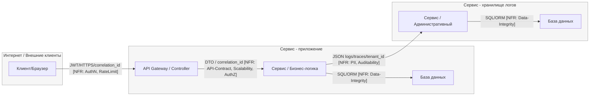

# TM - Требования безопасности + Модель угроз + ADR

## 0) Мета

- **Проект:** Учебный шаблон
- **Версия (commit/date):** - / 2025-10-12
- **Кратко (1-2 предложения):** Приложение представляет собой простой CRUD-сервис для создания и управления вишлистами пользователей.

---

## 1) Архитектура и границы доверия (TM1, S04)

- **Роли/активы:**
  - **Роли:** Пользователь, администратор.
  - **Активы:** Персональные данные пользователей (PII: email, имя), JWT-токены аутентификации, данные вишлистов.
- **Зоны доверия:**
  - **Internet:** Внешняя недоверенная зона, откуда приходят запросы пользователей.
  - **Internal:** Внутренняя зона, включающая сервисы приложения и хранилища логов (Service, Logs_Storage).
- **Context/DFD:**

- **Критичные интерфейсы и допущения:**
  - **Критичный интерфейс:** Поток `USER_AGENT -> Wishlist_GW` является основной точкой входа и пересекает границу доверия `Internet -> Service`. Все входящие данные из этой зоны считаются недоверенными.
  - **Допущения:** Внутренние коммуникации между сервисами (`Wishlist_Service -> Logs_Service`) считаются более доверенными, но требуют защиты от перехвата (например, с помощью mTLS), так как передают чувствительные данные.

---

## 2) Реестр угроз STRIDE (TM2, TM3, S04)

| Risk ID  | Source (DFD/Row)                                | Consolidated Description                                                                           | Threat (S/T/R/I/D/E)       | NFR link (ID)    | L (1-5) | Rationale-L                                                                                                   | I (1-5) | Rationale-I                                                                                                           | **Score (=L×I)** | Decision (Top-5?) | ADR candidate                                 |
| -------- | ----------------------------------------------- | -------------------------------------------------------------------------------------------------- | -------------------------- | ---------------- | ------: | ------------------------------------------------------------------------------------------------------------- | ------: | --------------------------------------------------------------------------------------------------------------------- | ---------------: | ----------------- | --------------------------------------------- |
| **R-01** | Edge: WS -> Logs, Logs_Service, Logs_PostgreSQL | **Утечка PII в логи** и их несанкционированное чтение.                                             | I (Information Disclosure) | NFR-007          |       4 | Очень распространенная ошибка — логирование целых объектов для отладки, что случайно захватывает PII.         |       4 | Нарушение GDPR/законов о приватности. Высокий репутационный ущерб и возможные штрафы. Затрагивает всех пользователей. |           **16** | **Top-1**         | PII Masking and Anonymization in Logs         |
| **R-02** | Edge: UA -> GW, Wishlist_GW                     | **Отказ в обслуживании (DoS)** из-за DDoS-атак или исчерпания ресурсов.                            | D (Denial of Service)      | NFR-001, NFR-002 |       4 | Публичные API — постоянная цель для автоматизированных атак и ботнетов. Вероятность атаки высока.             |       4 | Полный или частичный простой сервиса, затрагивающий всех клиентов. Прямые финансовые и репутационные потери.          |           **16** | **Top-2**         | Rate Limiting & Autoscaling Strategy          |
| **R-03** | Wishlist_Service, Edge: WS -> PG                | **Обход изоляции тенантов** и доступ к чужим данным через уязвимости в логике.                     | I / E                      | NFR-005, NFR-010 |       3 | Классическая уязвимость в multi-tenant системах (IDOR, отсутствие `WHERE tenant_id`). Легко допустить ошибку. |       5 | Критическое нарушение: компрометация данных всех клиентов. Полная потеря доверия, массовая утечка данных.             |           **15** | **Top-3**         | Tenant Isolation via Row-Level Security (RLS) |
| **R-04** | Wishlist_Service                                | **Эскалация привилегий** через обход RBAC, позволяющая пользователю получить права администратора. | E (Elevation of Privilege) | NFR-005, NFR-006 |       3 | Требует знания бизнес-логики, но ошибки в проверках прав являются частым явлением в сложных системах.         |       5 | Полная компрометация системы. Злоумышленник может управлять всеми данными и пользователями.                           |           **15** | **Top-4**         | Centralized RBAC Enforcement Policy           |
| **R-05** | Edge: UA -> GW                                  | **Несанкционированный доступ к аккаунту** через кражу/перехват/повторное использование JWT.        | S (Spoofing)               | NFR-009          |       4 | Фишинг, вредоносное ПО на стороне клиента, перехват токена в незащищенных сетях — частые сценарии.            |       3 | Ущерб ограничен одним пользователем, но включает кражу его PII и возможность действий от его имени.                   |           **12** | **Top-5**         | JWT Lifecycle and Security Policy             |
| **R-06** | Edge: WS -> PG                                  | **Выполнение произвольного кода в БД (SQL-инъекция)** для кражи или изменения данных.              | T / I                      | NFR-010          |       2 | Современные ORM значительно снижают риск, но он все еще существует при использовании raw SQL-запросов.        |       5 | Потенциальная компрометация всей базы данных, включая данные всех тенантов; возможность удаления данных.              |           **10** |                   | Secure DB Access Policy (ORM only)            |
| **R-07** | Все рёбра/узлы                                  | **Невозможность расследовать инцидент** из-за потери логов или отсутствия сквозной трассировки.    | R (Repudiation)            | NFR-004, NFR-008 |       3 | Сбои в системе логирования или ошибки в конфигурации могут легко привести к потере данных для аудита.         |       3 | Затрудняет расследование, но не наносит прямого ущерба пользователям. Влияет на compliance и внутренние процессы.     |            **9** |                   | Resilient Auditing and Tracing                |
| **R-08** | Logs_Service, Edge: Logs -> L-PG                | **Несанкционированное изменение/удаление аудит-логов** для сокрытия следов.                        | T / R                      | NFR-008          |       2 | Требует доступа к системе логов, что маловероятно для внешнего актора, но возможно для инсайдера.             |       4 | Подрыв доверия к системе аудита. Критично для прохождения compliance-проверок и расследования инцидентов.             |            **8** |                   | Immutable Log Storage (WORM)                  |

---

## 3) Приоритизация и Top-5 (TM3, S04)

1.  **R-01 Утечка PII в логи** - L×I=16; очень распространенная ошибка, высокий репутационный ущерб и нарушение GDPR.
2.  **R-02 Отказ в обслуживании (DoS)** - L×I=16; публичный API является постоянной целью атак, что ведет к простою сервиса.
3.  **R-03 Обход изоляции тенантов** - L×I=15; критическое нарушение, ведущее к массовой утечке данных всех клиентов.
4.  **R-04 Эскалация привилегий** - L×I=15; полная компрометация системы, злоумышленник может управлять всеми данными.
5.  **R-05 Несанкционированный доступ к аккаунту** - L×I=12; наиболее вероятная угроза со стороны клиента через фишинг или вредоносное ПО.

---

## 4) Требования (S03) и ADR-решения (S05) под Top-5 (TM4)

### NFR-001. Application Performance

- **AC (GWT):**
  - **Given** сервис под нагрузкой 1000 RPS 
  - **When** GET /api/items с любыми входными параметрами 
  - **Then** 429 Too Many Requests

### NFR-002. Application Scalability

- **AC (GWT):**
  - **Given** базовая нагрузка 250 RPS 
  - **When** нагрузка возрастает до 500 RPS за 2 мин 
  - **Then** P95 ≤ 300ms, автоскейлинг добавляет ≥1 реплику

### NFR-007. PII masking and anonymization in logs

- **AC (GWT):**
  - **Given** пользователь с email "user@example.com" 
  - **When** операция логируется 
  - **Then** email не фигурирует в логах

---

### Краткие ADR (минимум 2) - архитектурные решения S05

#### ADR-001 - PII Masking and Anonymization in Logs

- **Context (угрозы/NFR):** R-01 (Утечка PII), NFR-007 (Privacy/PII).
- **Decision:** Внедрение автоматического маскирования PII на уровне `Wishlist_Service` до отправки логов. Поля с PII помечаются аннотацией `@PiiField`.
- **Trade-offs (кратко):** Небольшое увеличение CPU usage; необходимость аннотировать существующий код.
- **DoD (готовность):** При логировании объекта с `email` в хранилище логов это поле отсутствует или замаскировано.
- **Owner:** Security Team Lead
- **Evidence (план/факт):** `EVIDENCE/sast-pii-scan-2025-10-15.json`

#### ADR-002 - Rate Limiting and Autoscaling Strategy

- **Context:** R-02 (DoS), NFR-001 (Performance), NFR-002 (Scalability).
- **Decision:** Настроить Rate Limiting (по IP и User ID) на API Gateway с возвратом заголовка `Retry-After`. Настроить Horizontal Pod Autoscaling (HPA) для `Wishlist_Service` по CPU > 70%.
- **Trade-offs:** Усложнение клиентской логики (требуется Exponential Backoff); необходимость тонкой настройки лимитов.
- **DoD:** При превышении лимита возвращается `429` + `Retry-After`. При росте нагрузки CPU > 70% кол-во реплик увеличивается.
- **Owner:** DevOps Team Lead
- **Evidence (план/факт):** `EVIDENCE/load-test-report-2025-10-16.png`

---

## 5) Трассировка Threat -> NFR -> ADR -> (План)Проверки (TM5)

| Threat                          | NFR              | ADR                               | Чем проверяем (план/факт)                                                                  |
| :------------------------------ | :--------------- | :-------------------------------- | :----------------------------------------------------------------------------------------- |
| **R-01** - Утечка PII           | NFR-007          | ADR-001                           | SAST-скан на PII в логах, ручной аудит логов -> `EVIDENCE/sast-pii-scan.json`              |
| **R-02** - DoS                  | NFR-001, NFR-002 | ADR-002                           | Нагрузочный тест на проверку 429 и HPA -> `EVIDENCE/load-test-report.png`                  |
| **R-03** - Обход изоляции       | NFR-005, NFR-010 | Tenant Isolation via RLS          | Интеграционные тесты на доступ к данным чужого тенанта -> `EVIDENCE/integration-tests.xml` |
| **R-04** - Эскалация привилегий | NFR-005, NFR-006 | Centralized RBAC Policy           | Интеграционные тесты на проверку границ ролей -> `EVIDENCE/rbac-tests.xml`                 |
| **R-05** - Подмена личности     | NFR-009          | JWT Lifecycle and Security Policy | DAST-скан на уязвимости JWT (replay, слабые подписи) -> `EVIDENCE/zap-scan-auth.html`      |

---

## 6) План проверок (мост в DV/DS)

- **SAST/Secrets/SCA:**
  - Инструменты: `Semgrep` для SAST, `Gitleaks` для поиска секретов.
  - Отчеты: `EVIDENCE/sast-report.json`, `EVIDENCE/sca-report.json`.
- **SBOM:**
  - Генератор/формат: `syft` генератор `SBOM`. Отчет: `EVIDENCE/sbom.json`.
- **DAST (если применимо):**
  - Инструмент: `OWASP ZAP`.
